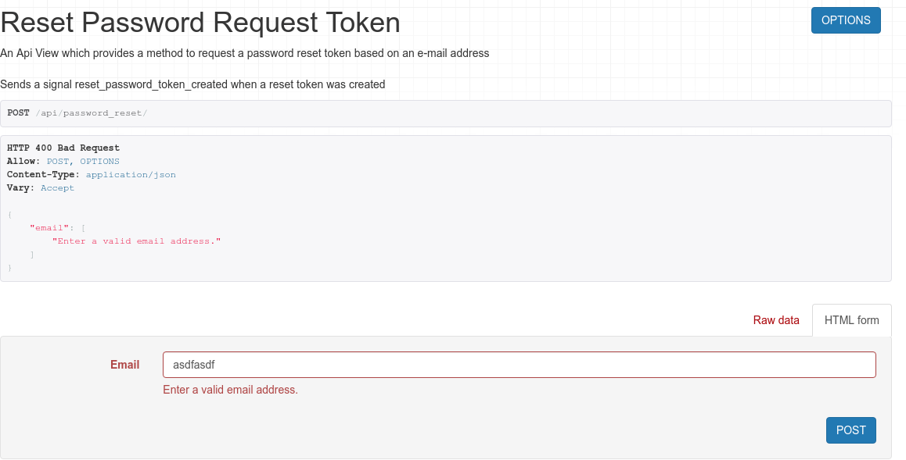
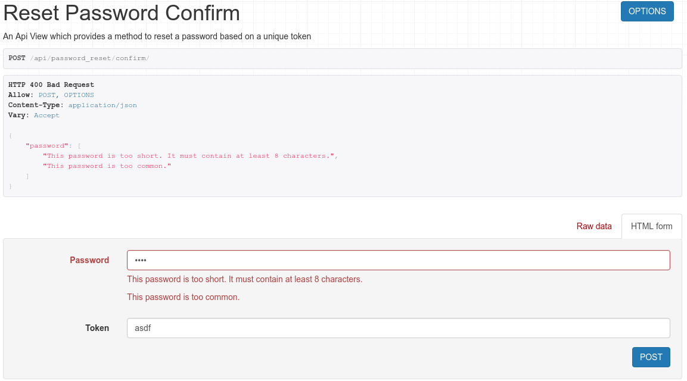
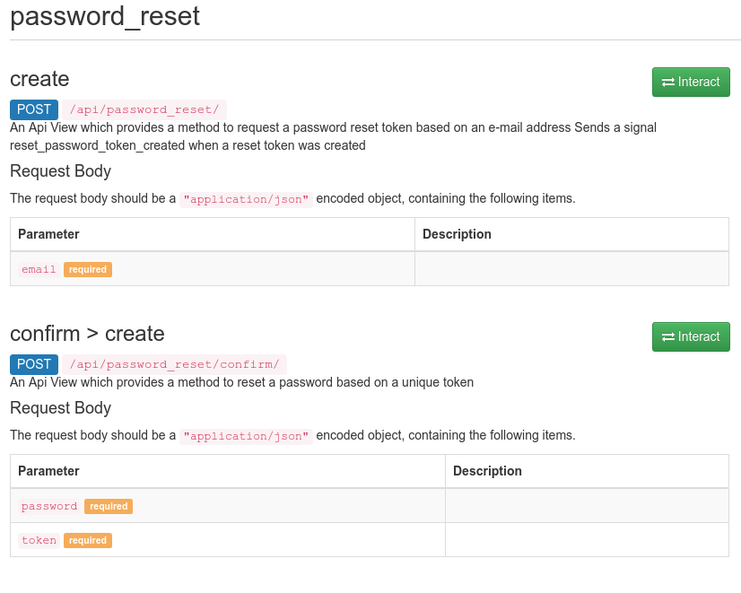

# Django Rest Password Reset

[](https://badge.fury.io/py/django-rest-passwordreset)
[](https://travis-ci.org/anx-ckreuzberger/django-rest-passwordreset)
[](https://snyk.io/test/github/anx-ckreuzberger/django-rest-passwordreset?targetFile=requirements.txt)

This python package provides a simple password reset strategy for django rest framework, where users can request password 
reset tokens via their registered e-mail address.

The main idea behind this package is to not make any assumptions about how the token is delivered to the end-user (e-mail, text-message, etc...).
Instead, this package provides a signal that can be reacted on (e.g., by sending an e-mail or a text message).

This package basically provides two REST endpoints:

* Request a token
* Verify (confirm) a token (and change the password)

## Quickstart

1. Install the package from pypi using pip:
```bash
pip install django-rest-passwordreset
```

2. Add ``django_rest_passwordreset`` to your ``INSTALLED_APPS`` (after ``rest_framework``) within your Django settings file:
```python
INSTALLED_APPS = (
    ...
    'django.contrib.auth',
    ...
    'rest_framework',
    ...
    'django_rest_passwordreset',
    ...
)
```

3. This package provides two endpoints, which can be included by including ``django_rest_passwordreset.urls`` in your ``urls.py`` as follows:
```python
from django.conf.urls import url, include


urlpatterns = [
    ...
    url(r'^api/password_reset/', include('django_rest_passwordreset.urls', namespace='password_reset')),
    ...
]    
```
**Note**: You can adapt the url to your needs.

### Endpoints

The following endpoints are provided:

 * `POST ${API_URL}/reset_password/` - request a reset password token by using the ``email`` parameter
 * `POST ${API_URL}/reset_password/confirm/` - using a valid ``token``, the users password is set to the provided ``password``
 
where `${API_URL}/` is the url specified in your *urls.py* (e.g., `api/password_reset/`)
 

### Configuration / Settings

The following settings can be set in Djangos ``settings.py`` file:

* `DJANGO_REST_MULTITOKENAUTH_RESET_TOKEN_EXPIRY_TIME` - time in hours about how long the token is active (Default: 24)

  **Please note**: expired tokens are automatically cleared based on this setting in every call of ``ResetPasswordRequestToken.post``.
 
### Signals

* ``reset_password_token_created(reset_password_token)`` Fired when a reset password token is generated
* ``pre_password_reset(user)`` - fired just before a password is being reset
* ``post_password_reset(user)`` - fired after a password has been reset

### Example for sending an e-mail

1. Create two new django templates: `email/user_reset_password.html` and `email/user_reset_password.txt`. Those templates will contain the e-mail message sent to the user, aswell as the password reset link (or token).
Within the templates, you can access the following context variables: `current_user`, `username`, `email`, `reset_password_url`. Feel free to adapt this to your needs.

2. Add the following code, which contains a Django Signal, to your application (see [this part of the django documentation](https://docs.djangoproject.com/en/1.11/topics/signals/#connecting-receiver-functions) for more information on where to put signals).
```python
from django.dispatch import receiver
from django_rest_passwordreset.signals import reset_password_token_created
from django.urls import reverse


@receiver(reset_password_token_created)
def password_reset_token_created(sender, reset_password_token, *args, **kwargs):
    """
    Handles password reset tokens
    When a token is created, an e-mail needs to be sent to the user
    :param sender:
    :param reset_password_token:
    :param args:
    :param kwargs:
    :return:
    """
    # send an e-mail to the user
    context = {
        'current_user': reset_password_token.user,
        'username': reset_password_token.user.username,
        'email': reset_password_token.user.email,
        'reset_password_url': "{}?token={}".format(reverse('password_reset:reset-password-request'), reset_password_token.key)
    }

    # render email text
    email_html_message = render_to_string('email/user_reset_password.html', context)
    email_plaintext_message = render_to_string('email/user_reset_password.txt', context)

    msg = EmailMultiAlternatives(
        # title:
        _("Password Reset for {title}".format(title="Some website title")),
        # message:
        email_plaintext_message,
        # from:
        "noreply@somehost.local",
        # to:
        [reset_password_token.user.email]
    )
    msg.attach_alternative(email_html_message, "text/html")
    msg.send()

```

3. You should now be able to use the endpoints to request a password reset token via your e-mail address. 
If you want to test this locally, I recommend using some kind of fake mailserver (such as maildump).


## Custom Token Generator

By default, a random string token of length 10 to 50 is generated using the ``RandomStringTokenGenerator`` class.
This library offers a possibility to configure the params of ``RandomStringTokenGenerator`` as well as switch to
another token generator, e.g. ``RandomNumberTokenGenerator``. You can also generate your own token generator class.

You can change that by adding 
```python
DJANGO_REST_PASSWORDRESET_TOKEN_CONFIG = {
    "CLASS": ...,
    "OPTIONS": {...}
}
```
into Django settings.py file.


### RandomStringTokenGenerator
This is the default configuration. 
```python
DJANGO_REST_PASSWORDRESET_TOKEN_CONFIG = {
    "CLASS": "django_rest_passwordreset.tokens.RandomStringTokenGenerator"
}
```

You can configure the length as follows:
```python
DJANGO_REST_PASSWORDRESET_TOKEN_CONFIG = {
    "CLASS": "django_rest_passwordreset.tokens.RandomStringTokenGenerator",
    "OPTIONS": {
        "min_length": 20,
        "max_lenght": 30
    }
}
```
   

### RandomNumberTokenGenerator
```python
DJANGO_REST_PASSWORDRESET_TOKEN_CONFIG = {
    "CLASS": "django_rest_passwordreset.tokens.RandomNumberTokenGenerator"
}
```

You can configure the minimum and maximum number as follows:
```python
DJANGO_REST_PASSWORDRESET_TOKEN_CONFIG = {
    "CLASS": "django_rest_passwordreset.tokens.RandomNumberTokenGenerator",
    "OPTIONS": {
        "min_number": 1500,
        "max_number": 9999
    }
}
```


### Write your own Token Generator

Please see [token_configuration/django_rest_passwordreset/tokens.py](token_configuration/django_rest_passwordreset/tokens.py) for example implementation of number and string token generator.

The basic idea is to create a new class that inherits from BaseTokenGenerator, takes arbitrary arguments (`args` and `kwargs`)
in the ``__init__`` function as well as implementing a `generate_token` function.

```python
from django_rest_passwordreset.tokens import BaseTokenGenerator


class RandomStringTokenGenerator(BaseTokenGenerator):
    """
    Generates a random string with min and max length using os.urandom and binascii.hexlify
    """

    def __init__(self, min_length=10, max_length=50, *args, **kwargs):
        self.min_length = min_length
        self.max_length = max_length

    def generate_token(self, *args, **kwargs):
        """ generates a pseudo random code using os.urandom and binascii.hexlify """
        # determine the length based on min_length and max_length
        length = random.randint(self.min_length, self.max_length)

        # generate the token using os.urandom and hexlify
        return binascii.hexlify(
            os.urandom(self.max_length)
        ).decode()[0:length]
```


## Compatibility Matrix

This library should be compatible with the latest Django and Django Rest Framework Versions. For reference, here is
a matrix showing the guaranteed and tested compatibility.

django-rest-passwordreset Version | Django Versions | Django Rest Framework Versions
--------------------------------- | ----------------| ------------------------------
0.9.7 | 1.8, 1.11, 2.0, 2.1 | 3.6 - 3.9
1.0 (WIP) | 1.11, 2.0, 2.2 | 3.6 - 3.9

## Documentation / Browsable API

This package supports the [DRF auto-generated documentation](https://www.django-rest-framework.org/topics/documenting-your-api/) (via `coreapi`) as well as the [DRF browsable API](https://www.django-rest-framework.org/topics/browsable-api/).








## Known Issues

### Django 2.1 Migrations - Multiple Primary keys for table ...
Django 2.1 introduced a breaking change for migrations (see [Django Issue #29790](https://code.djangoproject.com/ticket/29790)). We therefore had to rewrite the migration [0002_pk_migration.py](django_rest_passwordreset/migrations/0002_pk_migration.py) such that it covers Django versions before (`<`) 2.1 and later (`>=`) 2.1.

Some information is written down in Issue #8.

## Contributions

This library tries to follow the unix philosophy of "do one thing and do it well" (which is providing a basic password reset endpoint for Django Rest Framework). Contributions are welcome in the form of pull requests and issues! If you create a pull request, please make sure that you are not introducing breaking changes. 

## Tests

See folder [tests/](tests/). Basically, all endpoints are covered with multiple
unit tests.

Use this code snippet to run tests:
```bash
pip install -r requirements_test.txt
python setup.py install
cd tests
python manage.py test
```
