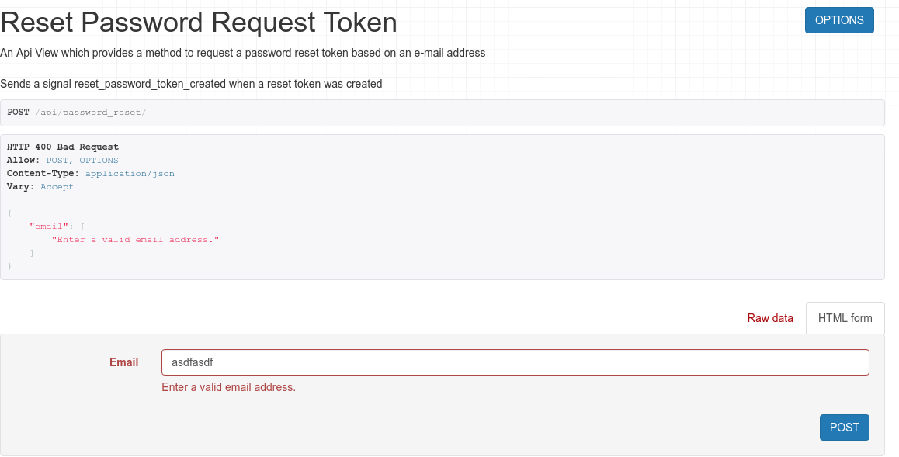
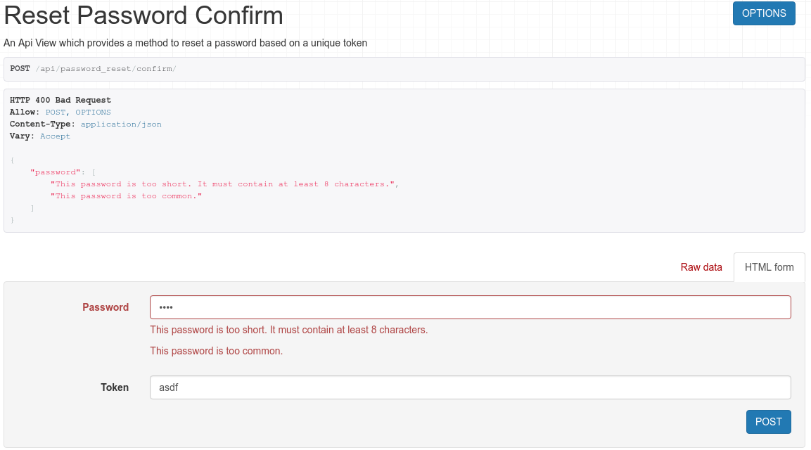
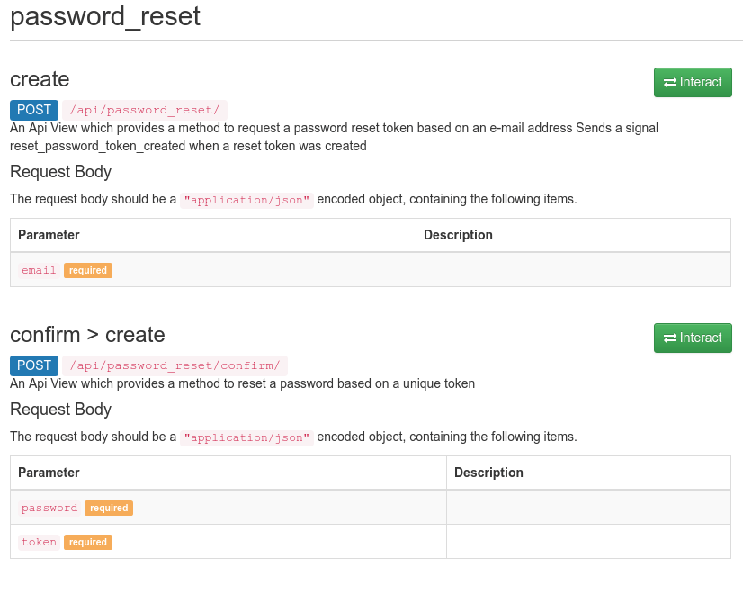

# Django Rest Password Reset

[](https://pypi.org/project/django-rest-passwordreset/)
[](https://github.com/anexia-it/django-rest-passwordreset/actions)
[](https://codecov.io/gh/anexia-it/django-rest-passwordreset)

This python package provides a simple password reset strategy for django rest framework, where users can request password 
reset tokens via their registered e-mail address.

The main idea behind this package is to not make any assumptions about how the token is delivered to the end-user (e-mail, text-message, etc...).
Instead, this package provides a signal that can be reacted on (e.g., by sending an e-mail or a text message).

This package basically provides two REST endpoints:

* Request a token
* Verify (confirm) a token (and change the password)

## Quickstart

1. Install the package from pypi using pip:
```bash
pip install django-rest-passwordreset
```

2. Add ``django_rest_passwordreset`` to your ``INSTALLED_APPS`` (after ``rest_framework``) within your Django settings file:
```python
INSTALLED_APPS = (
    ...
    'django.contrib.auth',
    ...
    'rest_framework',
    ...
    'django_rest_passwordreset',
    ...
)
```

3. This package stores tokens in a separate database table (see [django_rest_passwordreset/models.py](django_rest_passwordreset/models.py)). Therefore, you have to run django migrations:
```bash
python manage.py migrate
```

4. This package provides three endpoints, which can be included by including ``django_rest_passwordreset.urls`` in your ``urls.py`` as follows:
```python
from django.urls import path, include

urlpatterns = [
    ...
    path(r'^api/password_reset/', include('django_rest_passwordreset.urls', namespace='password_reset')),
    ...
]
```
**Note**: You can adapt the URL to your needs.

### Endpoints

The following endpoints are provided:

 * `POST ${API_URL}/` - request a reset password token by using the ``email`` parameter
 * `POST ${API_URL}/confirm/` - using a valid ``token``, the users password is set to the provided ``password``
 * `POST ${API_URL}/validate_token/` - will return a 200 if a given ``token`` is valid
 
where `${API_URL}/` is the url specified in your *urls.py* (e.g., `api/password_reset/` as in the example above)

 
### Signals

* ``reset_password_token_created(sender, instance, reset_password_token)`` Fired when a reset password token is generated
* ``pre_password_reset(sender, user, reset_password_token)`` - fired just before a password is being reset
* ``post_password_reset(sender, user, reset_password_token)`` - fired after a password has been reset

### Example for sending an e-mail

1. Create two new django templates: `email/user_reset_password.html` and `email/user_reset_password.txt`. Those templates will contain the e-mail message sent to the user, aswell as the password reset link (or token).
Within the templates, you can access the following context variables: `current_user`, `username`, `email`, `reset_password_url`. Feel free to adapt this to your needs.

2. Add the following code, which contains a Django Signal Receiver (`@receiver(...)`), to your application. Take care where to put this code, as it needs to be executed by the python interpreter (see the section *The `reset_password_token_created` signal is not fired* below, aswell as [this part of the django documentation](https://docs.djangoproject.com/en/1.11/topics/signals/#connecting-receiver-functions) and [How to Create Django Signals Tutorial](https://simpleisbetterthancomplex.com/tutorial/2016/07/28/how-to-create-django-signals.html) for more information).
```python
from django.core.mail import EmailMultiAlternatives
from django.dispatch import receiver
from django.template.loader import render_to_string
from django.urls import reverse

from django_rest_passwordreset.signals import reset_password_token_created


@receiver(reset_password_token_created)
def password_reset_token_created(sender, instance, reset_password_token, *args, **kwargs):
    """
    Handles password reset tokens
    When a token is created, an e-mail needs to be sent to the user
    :param sender: View Class that sent the signal
    :param instance: View Instance that sent the signal
    :param reset_password_token: Token Model Object
    :param args:
    :param kwargs:
    :return:
    """
    # send an e-mail to the user
    context = {
        'current_user': reset_password_token.user,
        'username': reset_password_token.user.username,
        'email': reset_password_token.user.email,
        'reset_password_url': "{}?token={}".format(
            instance.request.build_absolute_uri(reverse('password_reset:reset-password-confirm')),
            reset_password_token.key)
    }

    # render email text
    email_html_message = render_to_string('email/user_reset_password.html', context)
    email_plaintext_message = render_to_string('email/user_reset_password.txt', context)

    msg = EmailMultiAlternatives(
        # title:
        "Password Reset for {title}".format(title="Some website title"),
        # message:
        email_plaintext_message,
        # from:
        "noreply@somehost.local",
        # to:
        [reset_password_token.user.email]
    )
    msg.attach_alternative(email_html_message, "text/html")
    msg.send()

```

3. You should now be able to use the endpoints to request a password reset token via your e-mail address. 
If you want to test this locally, I recommend using some kind of fake mailserver (such as maildump).


# Configuration / Settings

The following settings can be set in Django ``settings.py`` file:

* `DJANGO_REST_MULTITOKENAUTH_RESET_TOKEN_EXPIRY_TIME` - time in hours about how long the token is active (Default: 24)

  **Please note**: expired tokens are automatically cleared based on this setting in every call of ``ResetPasswordRequestToken.post``. The token-validation and password-confirm endpoints do **not** run this bulk cleanup (an expired token presented there is rejected and deleted individually by the serializer); running a full-table cleanup on those high-frequency, attack-exposed endpoints would be a DoS amplification vector. For reliable DB hygiene without relying on reset requests coming in, schedule the management command below.

### Token cleanup (expired-token removal)

The package ships a management command to bulk-remove expired tokens:

```
python manage.py clearresetpasswodtokens
```

It deletes every ``ResetPasswordToken`` with ``created_at`` older than
``DJANGO_REST_MULTITOKENAUTH_RESET_TOKEN_EXPIRY_TIME`` hours. **Schedule it** (cron, systemd timer,
Celery beat, Django-Q, or
[django-future-tasks](https://pypi.org/project/django-future-tasks/)) for periodic DB hygiene — for
example once an hour or once a day:

```
# crontab example: clear expired reset tokens every hour at :05
5 * * * * /path/to/venv/bin/python /path/to/manage.py clearresetpasswodtokens
```

This is the recommended way to keep the token table small. The cleanup query filters on indexed
``created_at`` values, avoiding an unindexed scan before deleting matching rows.

Individual expired tokens are *also* removed on use: when an expired token is submitted to the
validate or confirm endpoint, the serializer deletes that single token and rejects the request
(HTTP 404). The bulk command above is therefore about reclaiming rows for tokens that are never
presented again, not about security enforcement.

* `DJANGO_REST_PASSWORDRESET_NO_INFORMATION_LEAKAGE` - when `True` (the default in the next release), a `200 OK` is
  always returned on `POST ${API_URL}/reset_password/`, even if the user does not exist in the database,
  so the endpoint does not expose account existence via HTTP status or response body (CWE-204). Setting this
  to `False` restores the legacy behavior of returning a `400` for unknown accounts; this re-enables the
  enumeration oracle and is **deprecated** (will be removed in a future major release).
  Note: even with the default, a timing side channel may still distinguish existing from non-existing
  accounts (the existing-account path performs a DB write and fires `reset_password_token_created`).

* `DJANGO_REST_MULTITOKENAUTH_REQUIRE_USABLE_PASSWORD` - allows password reset for a user that does not 
  [have a usable password](https://docs.djangoproject.com/en/2.2/ref/contrib/auth/#django.contrib.auth.models.User.has_usable_password) (Default: True)

## Custom Email Lookup

By default, `email` lookup is used to find the user instance. You can change that by adding 
```python
DJANGO_REST_LOOKUP_FIELD = 'custom_email_field'
```
into Django settings.py file.

## Custom Remote IP Address and User Agent Header Lookup

If your setup demands that the IP adress of the user is in another header (e.g., 'X-Forwarded-For'), you can configure that (using Django Request Headers):

```python
DJANGO_REST_PASSWORDRESET_IP_ADDRESS_HEADER = 'HTTP_X_FORWARDED_FOR'
```

The same is true for the user agent:

```python
DJANGO_REST_PASSWORDRESET_HTTP_USER_AGENT_HEADER = 'HTTP_USER_AGENT'
```

## Custom Token Generator

By default, a random string token of length 10 to 50 is generated using the ``RandomStringTokenGenerator`` class.
This library offers a possibility to configure the params of ``RandomStringTokenGenerator`` as well as switch to
another token generator, e.g. ``RandomNumberTokenGenerator``. You can also generate your own token generator class.

You can change that by adding 
```python
DJANGO_REST_PASSWORDRESET_TOKEN_CONFIG = {
    "CLASS": ...,
    "OPTIONS": {...}
}
```
into Django settings.py file.


### RandomStringTokenGenerator
This is the default configuration. 
```python
DJANGO_REST_PASSWORDRESET_TOKEN_CONFIG = {
    "CLASS": "django_rest_passwordreset.tokens.RandomStringTokenGenerator"
}
```

You can configure the length as follows:
```python
DJANGO_REST_PASSWORDRESET_TOKEN_CONFIG = {
    "CLASS": "django_rest_passwordreset.tokens.RandomStringTokenGenerator",
    "OPTIONS": {
        "min_length": 20,
        "max_length": 30
    }
}
```

It uses `os.urandom()` to generate a good random string.
   

### RandomNumberTokenGenerator
```python
DJANGO_REST_PASSWORDRESET_TOKEN_CONFIG = {
    "CLASS": "django_rest_passwordreset.tokens.RandomNumberTokenGenerator"
}
```

You can configure the minimum and maximum number as follows:
```python
DJANGO_REST_PASSWORDRESET_TOKEN_CONFIG = {
    "CLASS": "django_rest_passwordreset.tokens.RandomNumberTokenGenerator",
    "OPTIONS": {
        "min_number": 1500,
        "max_number": 9999
    }
}
```

It uses `random.SystemRandom().randint()` to generate a good random number.


### Write your own Token Generator

Please see [token_configuration/django_rest_passwordreset/tokens.py](token_configuration/django_rest_passwordreset/tokens.py) for example implementation of number and string token generator.

The basic idea is to create a new class that inherits from BaseTokenGenerator, takes arbitrary arguments (`args` and `kwargs`)
in the ``__init__`` function as well as implementing a `generate_token` function.

```python
from django_rest_passwordreset.tokens import BaseTokenGenerator


class RandomStringTokenGenerator(BaseTokenGenerator):
    """
    Generates a random string with min and max length using os.urandom and binascii.hexlify
    """

    def __init__(self, min_length=10, max_length=50, *args, **kwargs):
        self.min_length = min_length
        self.max_length = max_length

    def generate_token(self, *args, **kwargs):
        """ generates a pseudo random code using os.urandom and binascii.hexlify """
        # determine the length based on min_length and max_length
        length = random.randint(self.min_length, self.max_length)

        # generate the token using os.urandom and hexlify
        return binascii.hexlify(
            os.urandom(self.max_length)
        ).decode()[0:length]
```


### Throttling

The endpoint to request a reset password token provides throttling.
Per default the throttling rate is `3/day` per IP address, applied via the library's
`ResetPasswordRequestTokenThrottle` (a DRF `UserRateThrottle` scoped to
`"django-rest-passwordreset-request-token"`).

The throttling rate can be customized using the `REST_FRAMEWORK` setting and the scope
`"django-rest-passwordreset-request-token"`:

```
REST_FRAMEWORK = {"DEFAULT_THROTTLE_RATES": {"django-rest-passwordreset-request-token": "5/hour"}}
```

The request-token throttle classes can also be replaced:

```
DJANGO_REST_PASSWORDRESET_THROTTLE_CLASSES = [
    "rest_framework.throttling.AnonRateThrottle",
]
```

By default, this setting is unset and the endpoint uses `ResetPasswordRequestTokenThrottle`. Setting
`DJANGO_REST_PASSWORDRESET_THROTTLE_CLASSES = []` delegates the request-token endpoint to DRF's global
`DEFAULT_THROTTLE_CLASSES` instead. If you do this, configure an equivalent global throttle; otherwise
you remove the built-in `3/day` request-token protection. For `ScopedRateThrottle`, the request-token
scope is `"django-rest-passwordreset-request-token"`.

The token-validation and password-confirm endpoints do not declare their own `throttle_classes`, so
an operator's `REST_FRAMEWORK["DEFAULT_THROTTLE_CLASSES"]` is respected for those endpoints. In earlier
versions, those endpoints declared `throttle_classes = ()` and silently bypassed global throttles.

The request-token endpoint is intentionally different by default: it uses its configured
`DJANGO_REST_PASSWORDRESET_THROTTLE_CLASSES`, so global `DEFAULT_THROTTLE_CLASSES` do not additionally
stack on that endpoint unless you set `DJANGO_REST_PASSWORDRESET_THROTTLE_CLASSES = []`.

For example, to use DRF's scoped throttling for all three password-reset endpoints:

```
DJANGO_REST_PASSWORDRESET_THROTTLE_CLASSES = []

REST_FRAMEWORK = {
    "DEFAULT_THROTTLE_CLASSES": [
        "rest_framework.throttling.ScopedRateThrottle",
    ],
    "DEFAULT_THROTTLE_RATES": {
        "django-rest-passwordreset-request-token": "5/hour",
        "django-rest-passwordreset-validate-token": "60/minute",
        "django-rest-passwordreset-confirm": "10/hour",
    },
}
```

When `ScopedRateThrottle` is active on any password-reset endpoint, every active scope must have a
matching entry in `DEFAULT_THROTTLE_RATES`. Omitting a rate for
`django-rest-passwordreset-request-token`, `django-rest-passwordreset-validate-token`, or
`django-rest-passwordreset-confirm` causes the affected endpoint to raise `ImproperlyConfigured`
(HTTP 500).

See also: https://www.django-rest-framework.org/api-guide/throttling/#setting-the-throttling-policy

If you use `AnonRateThrottle` or `UserRateThrottle` globally, configure the standard DRF `anon` and
`user` rates instead.


## Compatibility Matrix

This library should be compatible with the latest Django and Django Rest Framework Versions. For reference, here is
a matrix showing the guaranteed and tested compatibility.

django-rest-passwordreset Version | Django Versions     | Django Rest Framework Versions | Python |
--------------------------------- |---------------------| ------------------------------ | ------ |
0.9.7 | 1.8, 1.11, 2.0, 2.1 | 3.6 - 3.9 | 2.7
1.0 | 1.11, 2.0, 2.2 | 3.6 - 3.9 | 2.7
1.1 | 1.11, 2.2 | 3.6 - 3.9 | 2.7
1.2 | 2.2, 3.0, 3.1 | 3.10, 3.11 | 3.5 - 3.8
1.3 | 3.2, 4.0, 4.1 | 3.12, 3.13, 3.14 | 3.7 - 3.10
1.4 | 3.2, 4.2, 5.0 | 3.13, 3.14 | 3.8 - 3.12
1.5 | 4.2, 5.0, 5.1 | 3.15 | 3.9 - 3.13
1.6 (current) | 5.2, 6.0 | 3.16 | 3.10 - 3.14*

\* Django 6.0 is tested on Python 3.12 - 3.14, while Django 5.2 is tested on Python 3.10 - 3.14.

## Documentation / Browsable API

This package supports the [DRF auto-generated documentation](https://www.django-rest-framework.org/topics/documenting-your-api/) (via `coreapi`) as well as the [DRF browsable API](https://www.django-rest-framework.org/topics/browsable-api/).

To add the endpoints to the browsable API, you can use a helper function in your `urls.py` file:
```python
from rest_framework.routers import DefaultRouter
from django_rest_passwordreset.urls import add_reset_password_urls_to_router

router = DefaultRouter()
add_reset_password_urls_to_router(router, base_path='api/auth/passwordreset')
```

Alternatively you can import the ViewSets manually and customize the routes for your setup:
```python
from rest_framework.routers import DefaultRouter
from django_rest_passwordreset.views import ResetPasswordValidateTokenViewSet, ResetPasswordConfirmViewSet, \
    ResetPasswordRequestTokenViewSet

router = DefaultRouter()
router.register(
    r'api/auth/passwordreset/validate_token',
    ResetPasswordValidateTokenViewSet,
    basename='reset-password-validate'
)
router.register(
    r'api/auth/passwordreset/confirm',
    ResetPasswordConfirmViewSet,
    basename='reset-password-confirm'
)
router.register(
    r'api/auth/passwordreset/',
    ResetPasswordRequestTokenViewSet,
    basename='reset-password-request'
)
```








## Known Issues / FAQ

### Django 2.1 Migrations - Multiple Primary keys for table ...
Django 2.1 introduced a breaking change for migrations (see [Django Issue #29790](https://code.djangoproject.com/ticket/29790)). We therefore had to rewrite the migration [0002_pk_migration.py](django_rest_passwordreset/migrations/0002_pk_migration.py) such that it covers Django versions before (`<`) 2.1 and later (`>=`) 2.1.

Some information is written down in Issue #8.

### The `reset_password_token_created` signal is not fired
You need to make sure that the code with `@receiver(reset_password_token_created)` is executed by the python interpreter. To ensure this, you have two options:

1. Put the code at a place that is automatically loaded by Django (e.g., models.py, views.py), or

2. Import the file that contains the signal within your app.py `ready` function:

  *some_app/signals.py*
  ```python
  from django.core.mail import EmailMultiAlternatives
  from django.dispatch import receiver
  from django.template.loader import render_to_string
  from django.urls import reverse

  from django_rest_passwordreset.signals import reset_password_token_created


  @receiver(reset_password_token_created)
  def password_reset_token_created(sender, instance, reset_password_token, *args, **kwargs):
      # ...
  ```
  
  *some_app/app.py*
  ```python
  from django.apps import AppConfig

  class SomeAppConfig(AppConfig):
      name = 'your_django_project.some_app'
      verbose_name = 'Some App'

      def ready(self):
          import your_django_project.some_app.signals  # noqa
  ```
  
  *some_app/__init__.py*
  ```python
  default_app_config = 'your_django_project.some_app.SomeAppConfig'
  ```

### MongoDB not working

Apparently, the following piece of code in the Django Model prevents MongodB from working:

```python
 id = models.AutoField( 
     primary_key=True 
 ) 
```

See issue #49 for details.

## Contributions

This library tries to follow the unix philosophy of "do one thing and do it well" (which is providing a basic password reset endpoint for Django Rest Framework). Contributions are welcome in the form of pull requests and issues! If you create a pull request, please make sure that you are not introducing breaking changes. 

## Tests

See folder [tests/](tests/). Basically, all endpoints are covered with multiple
unit tests.

Follow below instructions to run the tests.
You may exchange the installed Django and DRF versions according to your requirements. 
:warning: Depending on your local environment settings you might need to explicitly call `python3` instead of `python`.
```bash
# install dependencies
python -m pip install --upgrade pip
pip install -r tests/requirements.txt

# setup environment
pip install -e .

# run tests
cd tests && python manage.py test
```

## Release on PyPi

To release this package on pypi, the following steps are used:

```bash
rm -rf dist/ build/
python setup.py sdist
twine upload dist/*
```
